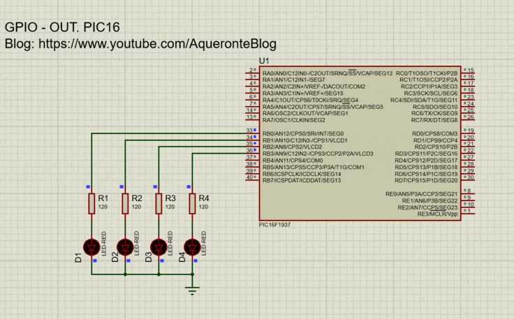
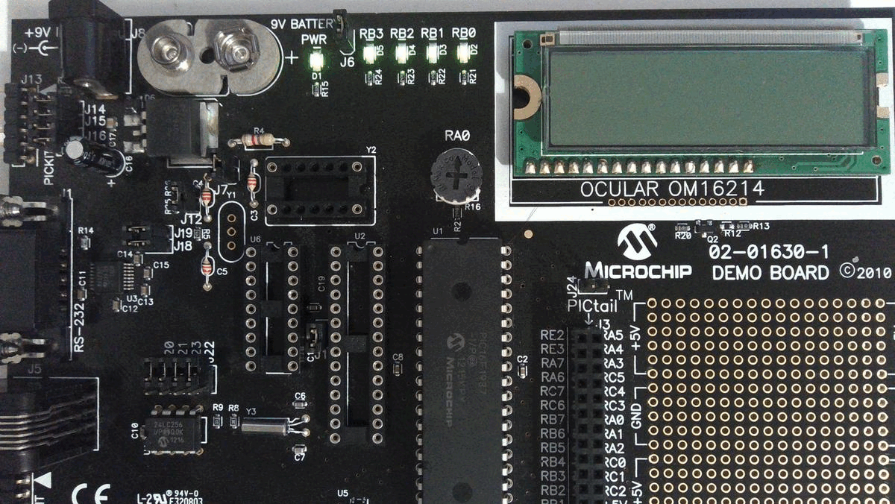

# Project: GPIO OUT
This project shows how to work with the internal peripheral GPIO as an output port. Four LEDs will change their states every one second approximately.
## Folders
- Source code
  - **src**. Functions
  - **inc**. Headers
- Proteus_Simulation
  -  **gpio_out_pic16f1937.pdsprj**. Proteus's project
  -  **gpio_out.X.production.hex**. Program file
## Tools
- PIC16F1937
- PICDEM2 PLUS
- MPLAB X IDE v6.15
  - Simulator
  - Debugger
- Pickit3
- XC8 v2.45 (Free version)
## Results
- Proteus simulation
  

- PICDEM2 PLUS
  

## Follow me!
- Youtube: [AqueronteBlog](https://www.youtube.com/AqueronteBlog)
- X (twitter): [Aqueronteblog](https://twitter.com/aqueronteblog)
